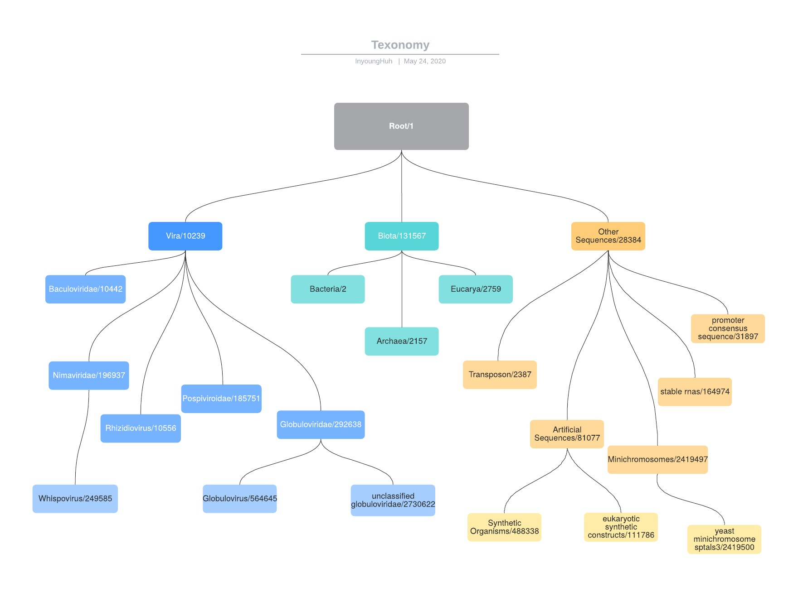
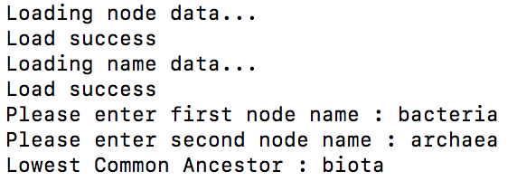
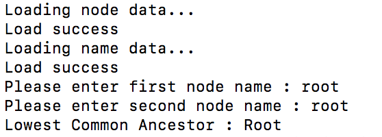

# TexonomyAnalysis
 The texonomy program implements an application that show the lowest common ancestor for two given nodes name.
 
 # Resource 
 -nodes.dmp
 -names.dmp
 
 # Texonomy Tree
 
 
 # Results
 
 
   